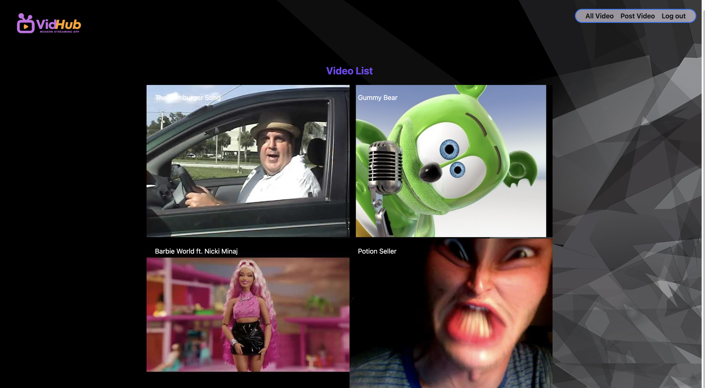
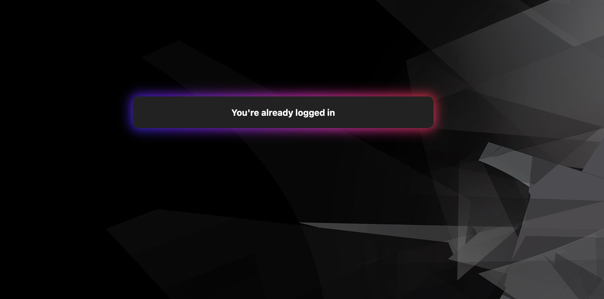
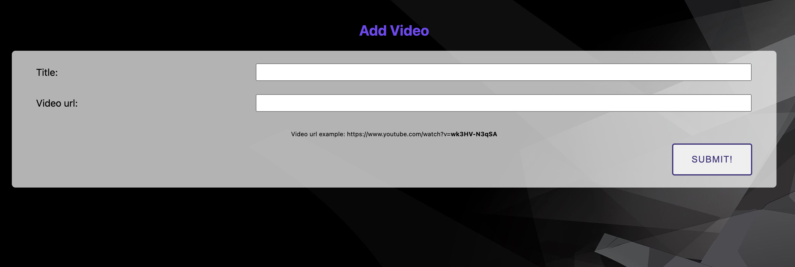

  

"Welcome to Videohub, your weekly dose of the hottest videos making waves across the internet! From jaw-dropping stunts to heartwarming moments, we've curated the ultimate countdown just for you. Join us as we explore the top trending videos that everyone's talking about. Let's dive right in!"

    "Because the best videos deserve the spotlight!" ---Abraham Lincoln

"maybe"

##  Sneak Peek 

##  Planning 
### WireFrame 

 
###  ERD 

##  Instruction 

Welcome aboard, you can start by going to https://vidhub-bd1dcc5fcda4.herokuapp.com/ and create a Username.

To post a video, you'll need to grab the video id from Youtube.

Example:  https://www.youtube.com/watch?v="grab-this-id"

# Technologies used

#  Attirbutions
<strong>Illustrations and Photos:<strong> https://www.canva.com/
 
<strong>Youtube Embedment:<strong> https://developers.google.com/youtube/player_parameters
 
<strong>CSS Animations:<strong> https://developer.mozilla.org/en-US/docs/Web/CSS/CSS_animations/Using_CSS_animations

#  Challenges Encountered During Development
My biggest challenge during this project development was trying to find a way to embed the youtube's img in the show page. After doing a little researching, it turns out easier than I thought it would be.

#  Next Step
· Embed videos from other site, instead of just youtube.  
· Add a forum page.  
· Add reply to posted comments.  
· Update more CSS.

